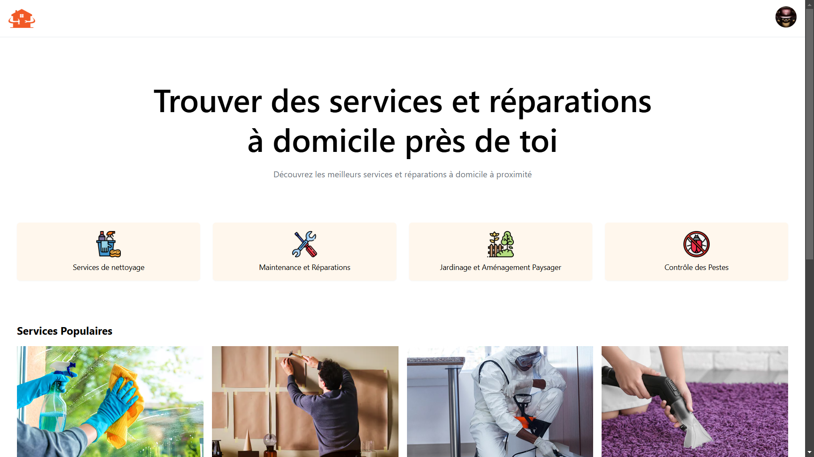
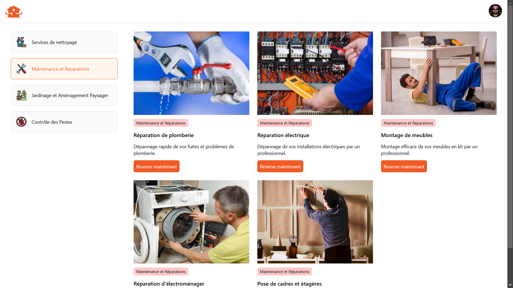
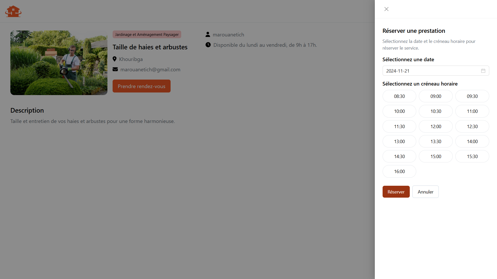

<!-- PROJECT LOGO -->
<p align="center">
  
</p>

<h3 align="center">Home Services App</h3>

<p align="center">
  A web application that connects customers with professional home service providers.
  <br />
  <a href="https://github.com/marouanetich/home-services-app"><strong>Explore the docs »</strong></a>
  <br />
  <br />
  <a href="https://github.com/marouanetich/home-services-app/issues">Report Bug</a>
  ·
  <a href="https://github.com/marouanetich/home-services-app/issues">Request Feature</a>
</p>

---

## About The Project

This Home Services App enables users to find, book, and review home service providers. Built using React for the front-end, Laravel for the back-end, and MySQL as the database, the application ensures a seamless and reliable experience.

> **Note:** This app might contain some bugs or incomplete features. We appreciate your understanding and welcome feedback to improve the app.

### Built With

- [React](https://reactjs.org/)
- [Laravel](https://laravel.com/)
- [MySQL](https://www.mysql.com/)

## Features

- User Authentication
- Service Listings and Filtering
- Booking Integration
- Customer and Provider Dashboards

## Screenshots

1. **Homepage**  
   *A clean homepage displaying available services.*  
   

2. **Categories**  
   *A categorized list of available home services.*  
   

3. **Service Booking**  
   *A user-friendly interface to book a service.*  
   

---

## Getting Started

Follow these instructions to set up the project locally.

### Prerequisites

- **PHP** (v8.0+ recommended) - [Download PHP](https://www.php.net/downloads.php)
- **Composer** - [Install Composer](https://getcomposer.org/download/)
- **Node.js** and **npm** - [Install Node.js and npm](https://nodejs.org/en/download/)
- **MySQL** - [Download MySQL](https://dev.mysql.com/downloads/)

### Installation

1. **Clone the Repository**
   ```bash
   git clone https://github.com/marouanetich/home-services-app.git
   cd home-services-app
2. **Navigate to the Back-End Directory**
   ```bash
   cd back-end
3. **Install Composer Dependencies**
   ```bash
   composer install
4. **Run Database Migrations**
   ```bash
   php artisan migrate
5. **Seed the Database**
   ```bash
   php artisan db:seed
6. **Start the Laravel Development Server**
   ```bash
   php artisan serve
7. **Navigate to the Front-End Directory**
    ```bash
    cd ../front-end
8. **Install NPM Dependencies**
    ```bash
    npm install
9. **Start the React Development Server**
    ```bash
    npm start
